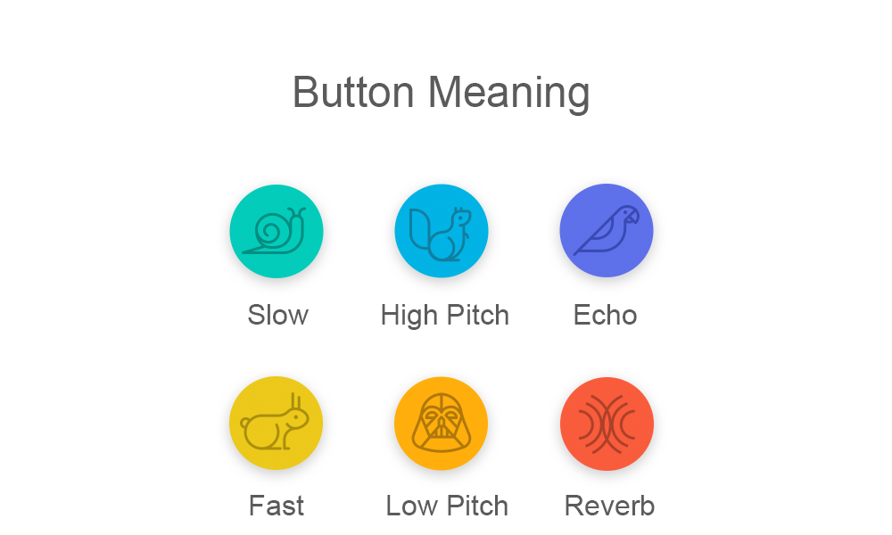

# Pitch Perfect 

A simple app that can save your voice to 6 different styles. Slow, Fast, High Pitch, Low Pitch, Echo and Reverb, respectively.

### 1. Prerequisites

+ Swift 3.x
+ Cocoa Touch
+ Xcode 8.3.3

### 2. Screenshot

### 3. How to Use ?

1. Download `zip` and double chick `PitchPerfect.xcodeproj`.
2. Run or press Command + R.
3. Use it in Xcode iOS simulator.

### 4. Feature

After the app runs, you can refer to the following features

+ Fast／Slow Voive features
+ High Pitch／Low Pitch features
+ Echo／Reverb features

### 5. License

[MIT License](https://github.com/windmill0503/pitchPerfect/blob/master/LICENSE)
